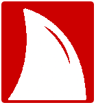
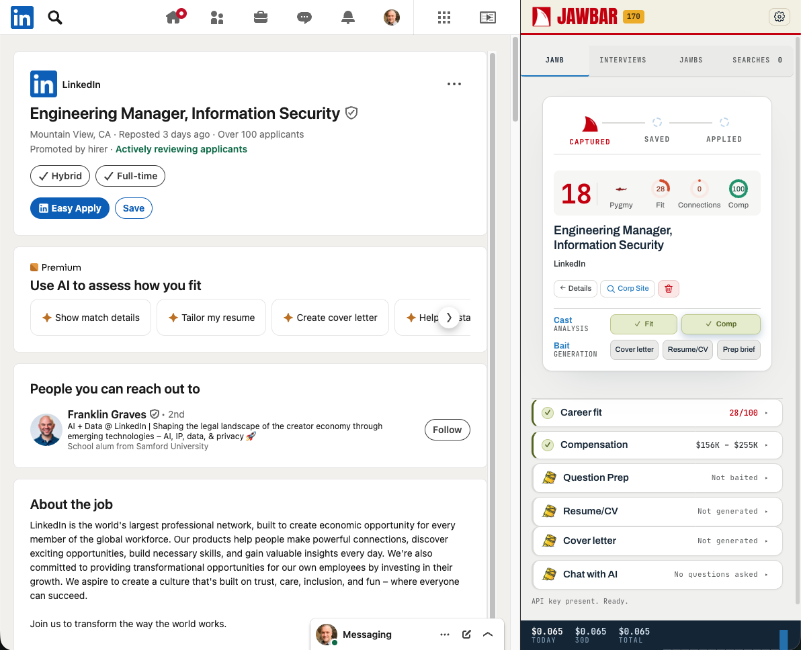
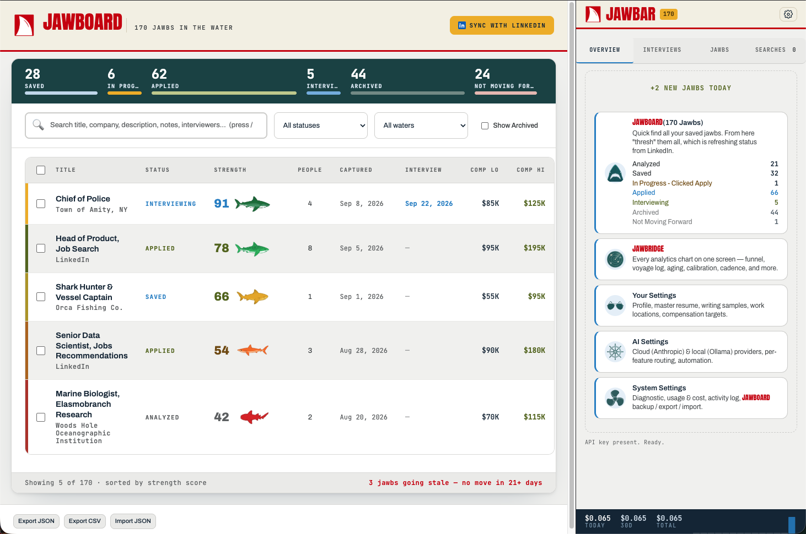
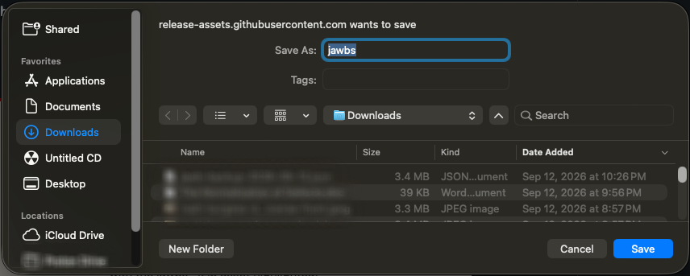
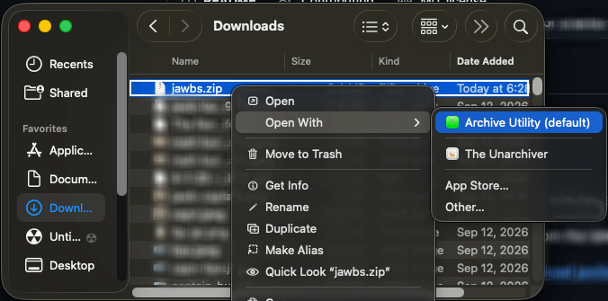
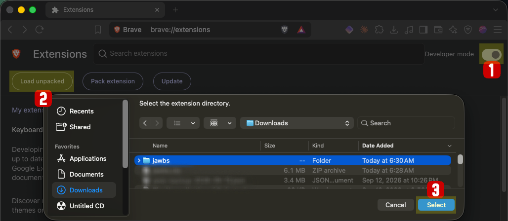
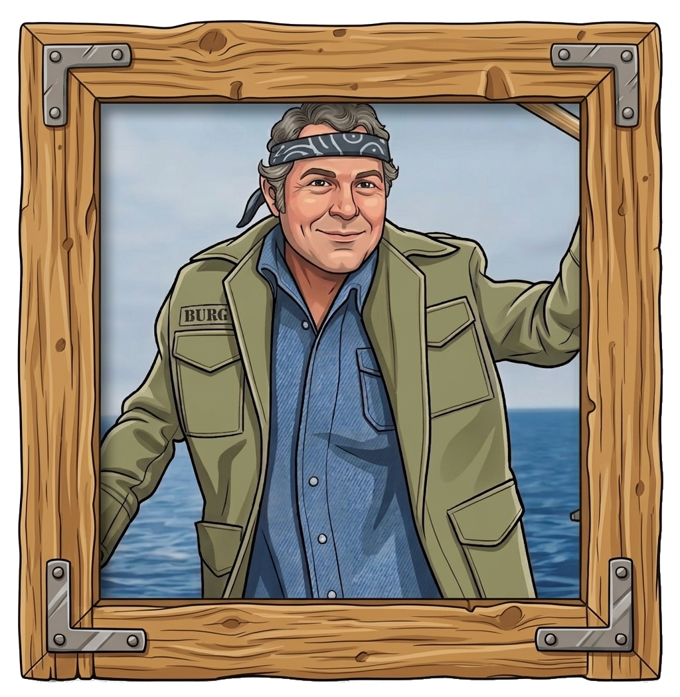
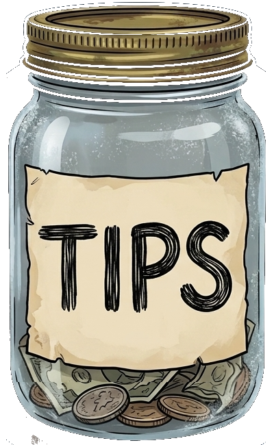

# Jawbs

**A browser-local job-search assistant for LinkedIn.** Analyzes fit, reads compensation, preps interview answers, drafts cover letters, and archives every jawb you save or apply to — all inside the **Jawbar** (Chromium side panel). Nothing leaves your machine except the AI calls you explicitly trigger.

<p align="center">
  
</p>

<p align="center">
  <em>Chromium extension · Manifest V3 · Anthropic Claude (with optional local Ollama routing)</em>
</p>

<p align="center">
  <a href="https://github.com/matt-burgess/jawbs/releases/download/continuous/jawbs.zip"></a>
  &nbsp;
  <a href="#install"></a>
  &nbsp;
  <a href="mailto:jawbsthebrowserextension@gmail.com"></a>
</p>

<p align="center">
  <sub>Three steps, about three minutes, no <code>git</code> required · <a href="#tip-your-captain">Tip your captain</a></sub>
</p>

---

## See it in action

The **Jawbar** side panel sits next to every LinkedIn job posting — one click gives you a fit score, comp read, and tailored paperwork.

<p align="center">
  
</p>

The **Jawboard** is your permanent archive — every jawb you've saved, applied to, or interviewed for, scored and sortable, with an overview of your pipeline on the right.

<p align="center">
  
</p>

---

## Why

LinkedIn's job UI optimizes for LinkedIn, not for you. Jawbs adds the **Jawbar** — a persistent side panel that reads the posting you're looking at, cross-references it against your own profile / resume / preferences, and answers the questions you actually have:

- Is this a real fit or just a keyword match?
- Is the pay in range, and where did that number come from?
- What should I ask the recruiter?
- What would a tailored resume for this role look like?
- Which of my prior applications is closest to this one?

Everything runs on demand. Nothing is auto-generated. No data leaves your browser except the AI calls you make.

## Install

Jawbs isn't in the Chrome Web Store yet, so you add it to your browser by hand. **Three steps, about three minutes, no `git` and no terminal.**


---

### Step 1 · Download the zip


<p align="center">
  <a href="https://github.com/matt-burgess/jawbs/releases/download/continuous/jawbs.zip"></a>
</p>

Click the red button above. Your browser will ask where to save it.

<p align="center">
  
</p>

### Step 2 · Unzip it

| Computer | How to Unzip a File |
|---|---|
| **Apple macOS** | Double-click `jawbs.zip` (or right-click → **Open With** → **Archive Utility**) |
| **Windows** | Right-click `jawbs.zip` → **Extract All** |

Place the folder wherever you like, but PLEASE NOTE that moving the folder after Step 3 will break the extension.

<p align="center">
  
</p>

### Step 3 · Load the folder into your browser

Open <a href="chrome://extensions">chrome://extensions</a> in your browser's address bar and press Enter. Then:

1. Flip the **Developer mode** toggle in the top-right corner.
2. Click **Load unpacked** on the left.
3. In the folder picker, select the unzipped **jawbs** folder and click **Select**.

<p align="center">
  
</p>

---

### You're in

The Jawbs card appears in your extensions list immediately.

1. **Pin the icon** from the toolbar's puzzle-piece menu.
2. **Click it** to open the side panel — the welcome tab loads on its own and walks you through the setup wizard.
3. **Paste an AI key** when the wizard asks. Anthropic, OpenAI, or Google Gemini all work.

 ***TIP*** Want to keep routine analyses off your API bill? Run [Ollama](https://ollama.com) locally — see [Local model (Ollama)](#local-model-ollama--optional).
<details>
<summary><b>Something went wrong?</b></summary>

<br />

| What you see | Fix |
|---|---|
| No **Load unpacked** button | Developer mode is still off. Flip the toggle in the top-right corner first. |
| "Manifest file is missing or unreadable" | You picked the zip, or a folder that *contains* the `jawbs` folder. Pick the **jawbs** folder itself — the one with `manifest.json` inside it. |
| The extension greys out or errors later | The folder was moved or deleted after loading. Put it back, or remove the card and redo Step 3. |
| Side panel is empty on a LinkedIn job | Refresh the LinkedIn tab — content scripts only inject on page load. |

Still stuck → **jawbsthebrowserextension@gmail.com**

</details>

<details>
<summary><b>Installing from source</b> — for hacking or contributing</summary>

<br />

```bash
git clone https://github.com/matt-burgess/jawbs.git
cd jawbs
```

Then load the `jawbs` folder as an unpacked extension using **Step 3** above. See
[CONTRIBUTING.md](./CONTRIBUTING.md) for dev workflow.

</details>

## Features

| | |
|---|---|
| **Jawboard** | Full-page archive of every saved / applied job. Sort, filter, export CSV/JSON. Boat-gauge instrument-panel analytics for status, fit distribution, salaries, application-to-interview velocity. |
| **Jawbridge** | A library of charts to review the jobs you have analyzed like standing on the bridge of a well-equipped ship. |
| **Fit Analysis** | Strict, calibrated score (0-100) with alignments, gaps, remote-authenticity check, and outreach guidance. Reasons against your specific positioning anchors — not generic keyword matching. |
| **Compensation Analysis** | Reads the posted range first, then research, then a title-benchmark fallback. Always shows the source. Flags postings below your floor. |
| **Connection Analysis** | Surfaces 1st-degree contacts at the company plus anyone on the hiring team (recruiter, hiring manager, poster, interviewer). Rolled into the composite Strength score so an in-network role reads visibly stronger. Also fixes LinkedIn's "who to follow" gap with concrete outreach suggestions. |
| **Interview Question Prep** | Configure a list of interview questions in Settings. One "Bait" click generates answers for the specific role in your voice. |
| **Tailored Cover Letter & Resume** | Drafted from your master materials — never invented experience. Copyable, printable to PDF. |
| **Chat with AI** | Freeform ask about this posting with the full context loaded (profile, resume, prior analyses). |
| **Saved LinkedIn Searches** | Save any `/jobs/search/*` URL. Suggestion pill nudges you toward high-signal filters (past 24h, in-network) most searches leave off. |
| **Auto-capture on LinkedIn Save/Apply** | Clicking LinkedIn's own Save or Apply button archives the job — no separate "Save to Job Thresher" click. |
| **Recall** | Full-page per-job view for interview rounds, timeline, comp offer form — the stuff that doesn't fit in the Jawbar. |
| **Local vs Cloud routing** | Anthropic Claude by default. Optional Ollama routing per-feature (Fit, Comp, Prep, Letter, Resume) — keeps routine work off your API bill. |
| **Personal-Tool disclaimer** | The API key sits in `chrome.storage.local` in plaintext. Appropriate for your own machine. Not appropriate for shared devices or org rollouts. |

## Privacy & data

- **All data is local.** `chrome.storage.local` on your machine.
- **API key is plaintext**, per Chrome extension convention. Not for shared devices.
- **No telemetry.** Nothing is logged, phoned home, or sent to any server other than the AI provider (`api.anthropic.com` or your local Ollama at `localhost:11434`).
- **Manual export/import**. `Jawboard → Export JSON` gives you a portable dump minus the API key. Import restores it.
- **Cost tracking is local** — token counts and cost estimates live in the Jawbar footer. Numbers are approximate; verify against your Anthropic console for billing.

## Architecture

**MV3 Chromium extension**, no build step, no bundler. Everything is native ES modules loaded straight by Chrome.

```
manifest.json          MV3 manifest — permissions, side panel, content scripts
service-worker.js      All API calls, storage writes, cross-context messaging
sidepanel/             The Jawbar — persistent side panel
  panel.html/.css/.js
options/               Full-page settings screen
archive/               Jawboard — searchable archive + analytics dashboard
recall/                Per-job full-page view (interview rounds, timeline, comp)
welcome/               First-run onboarding
content/               LinkedIn scraper + ATS form-fill helpers
  scrape.js            Main content script — job detection, save/apply watchers
  externalFill.js      Fill helpers for common ATS sites
  selectors.js         Selector maps used by scrape.js
lib/
  anthropic.js         Anthropic API client (browser-direct with dangerous header)
  json.js              JSON-response helper with retry
  ollamaClient.js      Local model client (Ollama)
  store.js             chrome.storage.local wrapper — settings + Jawboard + usage
  models.js            Model IDs + defaults
  pricing.js           Per-token cost calculation
  defaults.js          Placeholder profile / questions
  statuses.js          Canonical status vocabulary (LinkedIn-aligned)
  search.js            Fuzzy search across the Jawboard
  linkedInFill.js      Shared LinkedIn URL fill helper
  enrich.js            Fetch full posting via JSON-LD when scrape falls back
  prompts/             System prompts + user-message builders
    fit.js
    comp.js
    questionPrep.js
    coverLetter.js
    resume.js
    ask.js
    interviewRound.js
assets/                Icons, PNGs
styles/
  job-copilot.css      Shared design tokens + component styles
docs/                  Architecture notes
```

### Design choices worth knowing

- **Every API call is user-initiated.** No auto-analysis on scrape, tab focus, or panel open. Exception: LinkedIn Premium's "high match" postings can trigger auto-fit if enabled.
- **Capture is LinkedIn-driven.** No "Save to Jawboard" button. The content script watches for clicks on LinkedIn's own Save and Apply buttons.
- **Per-tab job state.** Each browser tab has its own current job in `chrome.storage.session`; multi-window LinkedIn use doesn't cross-contaminate.
- **Prompt versioning.** Every prompt module exports a `*_PROMPT_VERSION` constant. Analysis records store the version they were generated under, so re-running on a stored job is auditable.
- **Local ↔ cloud fallback.** If Ollama is enabled for a feature and fails or times out, the SW silently falls back to the cloud caller. Log entry marks it as `fellback: true`.
- **No build step.** Everything is native ES modules. `manifest.json` `"type": "module"` for the SW; content scripts use dynamic import for shared modules.

### Not in the box

- No test suite. This is a personal tool that ships to production every reload.
- No i18n. English only. LinkedIn URL matching assumes `www.linkedin.com/*`.
- No cross-device sync. Deliberate — the API key is one of the reasons.

## Development

No install / build. Iterate directly on the files:

```bash
# 1. Make changes
# 2. chrome://extensions → Reload
# 3. Refresh any open LinkedIn tabs (content scripts don't re-inject silently)
```

Debug consoles:
- **Jawbar / options / Jawboard**: right-click the page → Inspect
- **Service worker**: `chrome://extensions` → Jawbs → *Inspect views: service worker*
- **Content script**: DevTools on any linkedin.com tab → Console; filter for `[Jawbs]`

Syntax check before reload (all files are Node-parseable ES modules):

```bash
node --check service-worker.js sidepanel/panel.js archive/archive.js content/scrape.js
```

## Local model (Ollama) — optional

Route routine analyses (Fit, Comp, Question Prep) to a local model instead of paying for cloud tokens.

1. Install [Ollama](https://ollama.ai/)
2. Pull a capable model. Recommended: `qwen2.5:14b-instruct` (works well for Fit and Prep on a 32GB Mac)
3. Set `OLLAMA_ORIGINS="chrome-extension://*"` so the extension can reach the local API
4. In Options → AI Settings → Local (Ollama), enable it and check the features you want routed locally

Cloud remains the fallback on any local failure. Cover Letter and Tailored Resume stay cloud-only by default — they need the stronger model.

## Contributing

This started as, and remains, a personal-use tool. PRs welcome but expect an opinionated maintainer. See [CONTRIBUTING.md](./CONTRIBUTING.md) for the small print. In short:

- Keep to the "no build step" constraint
- No test suite → no need to add one; use `node --check` for syntax
- Match the existing code style (native ES modules, no bundler, no framework)
- Don't add telemetry, remote logging, or any auto-network-call outside the explicit AI provider path

## Tip your captain

<p align="center">
  <a href="https://buymeacoffee.com/mattburgess" title="Tip the captain">
    
  </a>
</p>

<p align="center">
  <a href="https://buymeacoffee.com/mattburgess" title="Buy me a coffee">
    
  </a>
</p>

<h3 align="center">
  <a href="https://buymeacoffee.com/mattburgess">Buy the captain a drink →</a>
</h3>

<p align="center">
  Jawbs is a one-person show. If it enhanced your job search, a few
  bucks in the jar keeps my boat afloat. Every tip is genuinely
  appreciated.
</p>

## Support

Questions, bug reports, or feature ideas → **jawbsthebrowserextension@gmail.com**

Prefer a channel with a paper trail? [Open a GitHub issue](https://github.com/matt-burgess/jawbs/issues).

## License

[MIT](./LICENSE) © 2026 Matt Burgess. Anton and Archivo (Google Fonts, Open Font License) power the brand type; shark-fin / captain / jawboard icons are original assets covered by this repo's license.

## Credits

Built by your captain, [Matt Burgess](https://www.linkedin.com/in/mattburgess/).
